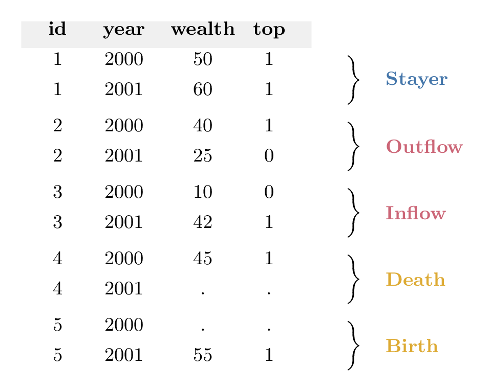

# topdecompose

This Stata command implements the decomposition from Gomez (["Decomposing the Growth of Top Wealth Shares"](https://doi.org/10.3982/ECTA21396), *Econometrica*, 2024). It decomposes the growth of average wealth in a top percentile into three terms:

- **Within** — the wealth growth of individuals initially in the top percentile, whether or not they remain in the top
- **Between** — composition changes as individuals move into and out of the top percentile (because of changes in rankings)
- **Demography** — composition changes from individuals entering and exiting the economy (births, deaths, and population growth)

The decomposition is exact: **total = within + between + demography**.

## How it works

Consider an unbalanced panel of individuals observed over multiple periods. For a given top percentile of the wealth distribution (e.g., the top 1%), let `top` equal 1 for individuals in the top percentile, 0 for those below, and missing for those not in the economy (e.g., deceased or not yet born). The idea of the decomposition is to classify each individual into one of five groups based on their `top` status across consecutive periods:

- **Stayer**: in the top in both periods (`top` goes from 1 to 1)
- **Outflow**: drops out of the top (`top` goes from 1 to 0)
- **Inflow**: enters the top from below (`top` goes from 0 to 1)
- **Death**: in the top, then exits the economy (`top` goes from 1 to `.`)
- **Birth**: enters the economy into the top (`top` goes from `.` to 1)

The following table illustrates how a panel dataset maps to this classification:

<p align="center">
  
</p>

The **between** term captures the effect of composition changes due to inflows and outflows on the average wealth in the top percentile. The **demography** term captures the effect of composition changes due to birth and death.

**Note 1:** An individual is considered "not in the economy" when `top` is neither 0 nor 1 for that individual at that time. This happens in two cases: either the individual has no observation in the panel for that period, or the individual has an observation but `top` is set to missing (`.`). Both formats are accepted and treated identically.

**Note 2:** When wealth is normalized by mean wealth in the economy, the decomposition applies to the growth of the top wealth *share* (see paper for details).

## Syntax

```stata
topdecompose varname, top(dummyvar) {save(filename) [replace] | clear} [prefix(string) detail]
```

**Required arguments:**
- `varname` — the variable to decompose (e.g., wealth)
- `top(dummyvar)` — a variable equal to 1 if the individual is in the top percentile, 0 if below the top but in the economy, or missing if not in the economy

**Output options (one required):**
- `save(filename)` — save the decomposition to an external dataset (`replace` to overwrite)
- `clear` — replace the current dataset with the decomposition output

**Optional:**
- `prefix(string)` — prefix for output variable names (e.g., `prefix(w_)` produces `w_total`, `w_within`, etc.)
- `detail` — additionally return the number of observations in each group, the average wealth in each group, and the percentile thresholds

The dataset must be declared as panel data before running the command (using `tsset`).

## Output

The command produces a dataset with one row per transition period containing:

| Variable | Description |
|----------|-------------|
| `{timevar}0`, `{timevar}1` | Start and end of the period |
| `total` | Total growth of average wealth in the top percentile |
| `within` | Within component |
| `between` | Between component (= `inflow` + `outflow`) |
| `inflow` | Inflow component |
| `outflow` | Outflow component |
| `demography` | Demography component (= `birth` + `death` + `popgrowth`) |
| `birth` | Birth component |
| `death` | Death component |
| `popgrowth` | Population growth component |

With the `detail` option, the output additionally includes the number of observations in each group (`N_P0`, `N_P1`, `N_I`, `N_O`, `N_B`, `N_D`), the average wealth at time 0 and/or time 1 in each group (`w0_P0`, `w1_P1`, `w1_I`, `w1_O`, `w1_B`, `w0_D`), and the percentile threshold at each time (`q0`, `q1`).

## Example: Forbes 400

The `example/` folder contains a worked example applying the decomposition to the Forbes 400, the list of the 400 wealthiest Americans published annually by Forbes from 2011 to 2017.

## Installation

```stata
net install topdecompose, from("https://raw.githubusercontent.com/matthieugomez/topdecompose/master/")
```

## References

Gomez, Matthieu. ["Decomposing the Growth of Top Wealth Shares."](https://doi.org/10.3982/ECTA21396) *Econometrica*, 2024.

## Author

Matthieu Gomez, Department of Economics, Columbia University.

Please report issues on [GitHub](https://github.com/matthieugomez/topdecompose).
